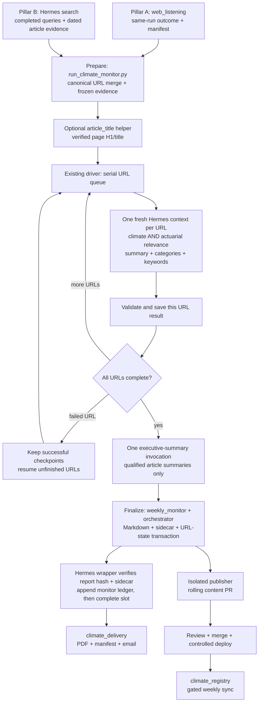
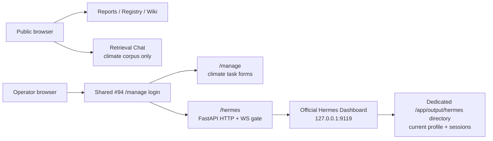

# Climate Monitor Wiki

A structured, interlinked knowledge base on climate risk, natural catastrophe insurance, and actuarial research, compiled weekly from automated monitoring.

**Status, 2026-09-08:** the URL-by-URL monitor and editable discovery/relevance
prompts are implemented and tested in the SSH sandbox. Production still uses
the legacy Step jobs; the four-slot deployment below has not been switched on.
Issue #87 was closed by the owner; its closure is not deployment evidence.
Pillar B now validates dated search evidence, and the monitor wrapper records
the report identity required by email. A complete run over the configured sites
and controlled deployment/scheduler verification remain cutover gates. See
[PIPELINE_REFERENCE.md](PIPELINE_REFERENCE.md#verification-and-cutover).

## Web + Obsidian Surfaces

This repo exposes the monitoring corpus through three public web tabs, an
authenticated Hermes operations link, and an Obsidian plugin:

- `Historical Reports` is the default operator archive for weekly narrative
  briefings, monitoring snapshots, PDFs, and their source articles.
- `Chat` uses a minimal single-column conversation layout inspired by `ferryhe/c-ross-2`, but recolored to match the Obsidian workspace.
- `Obsidian` restores the earlier browsing workspace with `Dataview`, `Note Detail`, and `Graph View` for selecting the active retrieval context.
  The page order is now `Dataview + Note Detail` first, then `Graph View`.
  The graph supports `Notes` and `Keywords` modes so you can switch between file links and a source-backed concept map.
  Both graph modes are precomputed by the API so the workspace can render quickly without rebuilding the graph client-side.
- `Hermes` appears only when the existing `/manage` operator session is active.
  It opens the official Hermes Web Dashboard at `/hermes`; it is an operations
  UI and is separate from the public, corpus-grounded retrieval `Chat` tab.
- `.obsidian/plugins/climate-agent-chat/` adds an Obsidian side-panel chat plugin that calls the same local API.

See [docs/ui-surfaces.md](docs/ui-surfaces.md) for the operator interfaces and
[PIPELINE_REFERENCE.md](PIPELINE_REFERENCE.md) for the current module map,
entrypoints and scheduled-job boundaries.

Use current `origin/main` for development and inspect the server checkout and
runtime before deployment. Superseded handoffs remain available in Git history;
they are not a current job inventory or a deployment baseline.

The active note chosen in the web Obsidian tab or the Obsidian plugin is sent as `contextPath`, so retrieval can prioritize the current page during chat.
Chat now also exposes three answer modes:

- `Brief`: faster, tighter synthesis
- `Detailed`: richer answers that pull more aggressively from `sources/` raw reports
- `Report`: a theme-clustered, date-coverage-aware report mode tuned for prompts such as `Summarize the past 4 weeks`

## Runtime

- `api_server.py` serves the Codespaces demo and the `/api/*` API routes.
- `agentic_wiki/` loads both `wiki/*.md` and `sources/*.md`, chunks notes and raw reports, plans retrieval, ranks evidence, and synthesizes cited answers.
- `climate_registry/` owns the historical SQLite Registry, DB-first Article
  Detail enrichment, weekly candidate transaction, and exact restore.
- `climate_delivery/` owns the retained 09:00 summary/PDF/manifest and email
  delivery pipeline.
- `showcase/` is a static frontend with the shared chat and wiki workspace.

Range-style weekly-report questions such as `Summarize the past 4 weeks`, `Give me an executive report for the past 12 weeks`, or `Summarize reports from 2026-07-27 to 2026-08-10` are anchored to the latest available corpus date. Chat covers the real reports found inside that calendar window and does not treat intervening non-report days as missing updates.

The chatbot can run in two modes:

- **OpenAI mode**: set `OPENAI_API_KEY` in your local `.env` or in your host's environment variables; answers are synthesized by `OPENAI_MODEL`.
- **Offline demo mode**: no key required; the app still demonstrates retrieval and cited extractive answers.

## Setup

From the repository root:

```bash
python -m venv .venv
source .venv/bin/activate
pip install -r requirements.txt
cp .env.example .env
```

Optional model-backed configuration:

```bash
OPENAI_API_KEY=sk-...
OPENAI_MODEL=gpt-5.4-mini
OPENAI_TEMPERATURE=0.2
SOURCE_DIR=sources
RELOAD_TOKEN=your-shared-secret
```

In GitHub Codespaces, prefer storing `OPENAI_API_KEY` as a Codespaces secret for this repository, then restart the Codespace so the variable is injected into the terminal and API process.

Your local `.env` is for development convenience only. Keep using `.env.example` as the template, and do not commit a real `.env` file.

## Run

```bash
source .venv/bin/activate
uvicorn api_server:app --host 0.0.0.0 --port 8501
```

Open the forwarded Codespaces port `8501`.

- `/` serves the web workspace.
- `GET /api/config` returns wiki metadata, retrieval corpus stats, answer mode defaults, prompt starters, and precomputed graph payloads for the Obsidian workspace.
- `POST /api/chat` runs retrieval + answering.
- `POST /api/reload` reloads the wiki files from disk.

Example API call:

```bash
curl -s http://localhost:8501/api/chat \
  -H "Content-Type: application/json" \
  -d '{"message":"What are the latest Climate Monitor highlights?","language":"en","answerMode":"detailed"}'
```

## When Sources Update

If `sources/` changes, do the following:

1. Add or update the raw file in `sources/`.
2. Regenerate the weekly report pages and `wiki/index.md`:

```bash
REPORT_DATE="<new Monday, YYYY-MM-DD>"
python scripts/sync_source_wiki.py --cadence weekly
python scripts/reload_and_smoke_test.py --date "$REPORT_DATE"
```

3. Confirm the reload and smoke test succeed for that same `REPORT_DATE`.

The detailed step-by-step workflow lives in [docs/source-update-sop.md](docs/source-update-sop.md).

## Modular weekly monitor

The canonical URL is the article identity. Pillar A and Pillar B describe how a
URL was discovered; the combined record retains every origin and source name.
Titles are metadata: different URLs with the same title remain separate articles.

| Module | Program/package | Responsibility |
|---|---|---|
| Site acquisition (Pillar A) | External `web_listening` public batch/export APIs | Site monitoring, governed readers and same-run outcome/manifest artifacts |
| Discovery (Pillar B) | Hermes tools + `weekly_monitor/prompt_loader.py`, `pillar_b_discovery.py` | Execute the editable search task; validate completed queries, report date and article publication evidence |
| Prepare and queue | `scripts/run_climate_monitor.py` | Validate inputs, merge URLs, freeze evidence, run/resume each URL serially |
| Candidate identity | `climate_monitor/article_candidate_contract.py`, `candidate_aggregation.py`, `dedupe.py` | Canonical URLs, merged origins and artifact identities |
| Evidence adapter | `climate_monitor/article_content_adapter.py` | Consume upstream public content results, preserve attempts/status/hashes and distinguish body, snippet and no evidence |
| Optional page titles | `climate_monitor/article_title.py` | Extract the current page H1/title offline, preserving capitalization |
| Authoring rules and validation | `climate_monitor/weekly_monitor/`, `climate_monitor/taxonomy.py` | Compose relevance rules, validate both relevance decisions, summary, categories and keywords |
| Report/state transaction | `climate_monitor/orchestrator.py`, `seen_state.py` | Finalize the validated Markdown, sidecar, candidate evidence and URL history |
| Delivery | `climate_delivery/` | Reuse the executive narrative, render PDF/manifest and perform retained email delivery |
| Publication | `scripts/publish_weekly_reports.py` | Regenerate wiki in an isolated clone and update the rolling content PR |
| Registry and application | `climate_registry/`, `agentic_wiki/`, `api_server.py` | Post-deploy Registry sync, historical reports, retrieval and web API |

### New flow

This diagram describes the implemented monitor and intended downstream cutover.
Acquisition and search must supply current artifacts before the monitor runs;
the monitor does not automatically perform Pillar B search.



Each URL sees only its own evidence. The relevance rules are maintained
separately but included in the same invocation as summary, categories and
keywords. There is no article-count cap. A failed URL does not stop the queue;
it blocks finalization until repaired. Resume revalidates successful checkpoints
and reuses frozen evidence. The executive summary has a separate checkpoint.
See [the runtime limitation](PIPELINE_CONFIG.md#monitor-v2-evidence-authoring):
one Hermes invocation is not a guarantee of one provider API request after a
stream failure.

### Module configuration

- Search wording: `monitoring/jobs/weekly-climate-monitor-08h/prompts/pillar-b-search-v1.prompt.md`.
- Relevance rules: the same directory's `article-relevance-v1.prompt.md`.
- Categories/semantic constraints: `monitoring/taxonomies/article_categories_v1.yaml`, validated against its versioned identity.
- Page titles: `python -m climate_monitor.article_title saved-page.html`; disable in the monitor with `--no-page-titles` on a fresh prepare.
- Article/executive response instructions currently remain in the existing CLI;
  the pinned `weekly-monitor-v1.prompt.md` retains its contract/provenance role.
  Not every prompt section has been externalized.

Keep these modules in the existing driver path. Reuse upstream public acquisition
APIs rather than copying reader policy into climate code. Remove imports, old
branches and configuration made unused by a replacement. Retire legacy Step
entrypoints only after their scheduler callers are disabled and equivalent
coverage is verified; the 2026-09-08 audit still found them enabled.

### Run and deployment references

[PIPELINE_REFERENCE.md](PIPELINE_REFERENCE.md) owns the detailed program/artifact
map, executable monitor command, resume behavior, compatibility boundary and
cutover evidence. [PIPELINE_CONFIG.md](PIPELINE_CONFIG.md) owns editable prompts,
runtime configuration and the intended Monday 08:00/09:00/10:00/10:30 UTC schedule.
Hermes uses Asia/Shanghai, so these are 16:00/17:00/18:00/18:30 local time.

The 09:00 delivery path owns the PDF/manifest and retained email. Publication
uses **generate → isolated rolling PR → review/merge → deploy**. Registry sync
requires that deployed report identity and explicit write gates. Generation
must use external state/output directories, leaving production `main` clean.
Hermes is the sole report generator; there is no GitHub Actions generator.

## Deploy on Render

This repo includes a [`render.yaml`](render.yaml) Blueprint and a [`.python-version`](.python-version) pin for Render.

If you deploy it as a Render web service, the relevant settings are:

- Build Command: `pip install -r requirements.txt`
- Start Command: `python -m scripts.run_render_web`
- Health Check Path: `/api/health`

The Render start command builds an ephemeral SQLite Registry from the tracked
`sources/` history before starting the API. This keeps Historical Reports usable
on Render's free, ephemeral filesystem. The Registry is rebuilt after each
restart or deploy; if `CLIMATE_REGISTRY_DB` is explicitly configured, that
external database is used instead and the bootstrap is skipped.

The Blueprint also sets:

- `PYTHON_VERSION=3.12.1`
- `OPENAI_MODEL=gpt-5.4-mini`
- `OPENAI_TEMPERATURE=0.2`
- `WIKI_DIR=wiki`
- `SOURCE_DIR=sources`
- `RELOAD_TOKEN` as a generated secret
- `OPENAI_API_KEY` as a placeholder secret (`sync: false`)

For secrets on Render:

- add `OPENAI_API_KEY` in the Render Environment page, or provide it during the initial Blueprint creation flow
- do not commit a real `.env` file to the repo
- if your key currently exists only as a GitHub or Codespaces secret, add the same value to Render separately

Render's environment variable docs describe setting secrets in the Render Dashboard, bulk-importing them from a local `.env`, or declaring placeholders in `render.yaml`.

## Obsidian Integration

The plugin already lives at:

```text
.obsidian/plugins/climate-agent-chat/
```

This is the only Obsidian file shipped in the repo; personal vault
configuration and other community plugins are local-only (gitignored).

To use it:

1. Start the API server with `uvicorn api_server:app --host 0.0.0.0 --port 8501`.
2. Open this folder as an Obsidian vault.
3. Enable **Climate Agent Chat** under Community plugins.
4. Click the message icon or run **Open Climate Agent Chat**.

For the best vault experience, install the following community plugins from
your local Obsidian (they are not bundled with the repo):

- `Dataview`
- `Obsidian Git`

The web workspace mirrors the Dataview browsing model with a Dataview-style
table and graph explorer.
The Obsidian plugin now also lets you switch between `Brief`, `Detailed`, and `Report` answers before sending.
For daily report notes, the detail panel's `Source` link opens the matching raw Markdown file under the GitHub repo's `main` branch `sources/` directory.

## Testing

Automated checks:

```bash
source .venv/bin/activate
python -m pytest
node --check showcase/app.js
```

Coverage today focuses on:

- wiki indexing and chunking
- raw `sources/` ingestion into retrieval
- `contextPath` ranking behavior
- `brief` vs `detailed` answer-mode behavior
- rolling date-window summary coverage such as `past 7 days`
- `/api/config` metadata needed by graph/dataview
- showcase root HTML contract for the chat and Obsidian tabs
- canonical URL/history selection, frozen evidence and serial authoring recovery
- editable prompts, page titles, uncapped reports and bound delivery semantics

Manual QA notes live in [docs/testing.md](docs/testing.md). UI surface details live in [docs/ui-surfaces.md](docs/ui-surfaces.md).

## Structure

```text
.
├── sources/           # Canonical daily/weekly reports; append-mostly source of truth
├── wiki/              # Derived report pages, topics, and Obsidian vault content
├── showcase/          # Three-tab static operator workspace
├── agentic_wiki/      # Mixed-corpus retrieval over wiki + raw sources
├── climate_registry/  # Historical Registry, enrichment, weekly sync and restore
├── climate_delivery/  # Summary/PDF/manifest and retained email delivery
├── scripts/           # Monitor, publisher, reload, Registry and QA entrypoints
├── tests/             # API, transaction, browser, and regression tests
└── .obsidian/         # Project Obsidian plugin (climate-agent-chat) only
```

## Reports

The report inventory is maintained in [wiki/index.md](wiki/index.md), with
original report content in [sources/](sources/). Weekly rendering
shows only dates with a real source report and never manufactures gap pages.

## Key Topics

- [[secondary-perils]] — 92% of nat-cat losses now come from secondary perils
- [[swiss-re-sigma]] — 2025 losses reached $107B; 2026 forecast $148B to $320B
- [[isbb-ifrs-s2]] — IFRS S2 implementation now spans industry updates and practical audit guidance ahead of 2027
- [[parametric-insurance]] — parametric cover is expanding from sovereign flood and cat bonds into retail heatwave and data-center climate-stress use cases
- [[climate-finance]] — 2026 focus has shifted from headline targets to implementing the $1.3T climate-finance pathway while adaptation gaps stay large
- [[actuaries-climate-index]] — ACI is increasingly used for insurance balance-sheet measurement as well as weather-derivatives work
- [[nat-cat-protection-gap]] — 49% gap concentrating risk on sovereigns
- [[iais-climate-risk]] — IAIS Holistic Framework + CLIMADA tool
- [[cas-soa-climate-research]] — CAS $75K RFP; SOA research

## Data Sources

Pillar A consumes the configured `web_listening` sites and their reviewed
acquisition scopes. Pillar B uses the editable search prompt to discover
additional articles. See [PIPELINE_CONFIG.md](PIPELINE_CONFIG.md) for configuration
ownership. A report's checked-site count comes from its actual upstream outcome,
not a fixed inventory or the number of discovered articles.

Generated previews and audit output belong in the ignored `/output/` directory
or external runtime storage. Canonical `sources/`, derived `wiki/`, and intentional
test fixtures remain tracked.

### Authenticated acquisition management

The optional `/manage` console edits the single versioned acquisition task,
starts or resumes it through Hermes, and reads progress from the #112 Registry
contract. It is disabled for login until `CLIMATE_CONSOLE_USERNAME`,
`CLIMATE_CONSOLE_PASSWORD_HASH`, and a stable `CLIMATE_CONSOLE_SESSION_SECRET` are
provided server-side. The shipped Compose deployment forwards those values,
defaults `CLIMATE_CONSOLE_SESSION_SECONDS` to 1800, forces
`CLIMATE_CONSOLE_SECURE_COOKIE=true`, and fails at container startup if the
credentials/signing secret are empty or secure cookies are disabled. Generate the
Argon2 hash without putting the plaintext password in Compose or shell history:

```bash
python -c 'from fastapi_users.password import PasswordHelper; import getpass; print(PasswordHelper().hash(getpass.getpass()))'
```

Set the printed value as `CLIMATE_CONSOLE_PASSWORD_HASH`. Credentials are never
returned to the browser. Put
`CLIMATE_TASK_CONFIG`, `CLIMATE_TASK_VERSION_DIR`, and
`CLIMATE_ACQUISITION_RUN_DIR` on persistent external storage in an operated
deployment. The repository bootstrap marker imports the former five prompt
locations; the first save writes one self-contained, atomically replaced state.

```text
authenticated browser (/manage)
    │ config/version/preview/save/restore + start/resume/status
    ▼
FastAPI Users + signed JWT cookie ───► versioned task definition
    │                                      │ immutable version + hashes
    │ detached start                       ▼
    └──────────────────────────────► Hermes Agent (`hermes chat`)
                                           │ native search/browser tools
                                           ▼
existing web-listening adapter + climate_registry.acquisition (#112)
                                           │ exact batch/content versions
                                           ▼
frozen report input ──► existing monitor authoring/checkpoint/publish gates
```

There is no console queue, search wrapper, second executor, or report/publish
bypass. Concurrent start/resume requests for the shared
monitor state are rejected by an interprocess lock; the worker owns that lock
from collection through report finalization. The scheduler snapshot remains separate from live
acquisition status. The Python 3.12 image installs `web-listening` 3.2.0 and an
editable Hermes Agent 0.20.5 checkout from immutable source commits; Hermes is
MIT-licensed, while `web-listening` is an internal source dependency with no
license metadata declared at the pinned revision. The Compose runtime volume is
seeded with the task definition only when empty, so later operator versions and
run evidence persist across container replacement. This diagram describes
implemented repository code, **not** evidence that production credentials,
storage, or schedules were deployed. See
[PIPELINE_CONFIG.md](PIPELINE_CONFIG.md) and [PIPELINE_REFERENCE.md](PIPELINE_REFERENCE.md)
for those operational gates.

### Authenticated Hermes operations UI

`/hermes` is a same-site reverse proxy to the **official** Hermes Web Dashboard,
not a replacement chat frontend. It reuses exactly the `/manage` FastAPI Users
login and `climate_console_session` cookie; there is no second account, login,
role, configuration form, or executor. Anonymous page requests redirect to
`/manage/login?next=/hermes`, while anonymous Dashboard HTTP and WebSocket
requests fail closed. Logging out revokes the presented session for subsequent
HTTP operations and closes its existing proxied WebSockets; token expiry is
also rechecked while a WebSocket is open.

Every successful login receives a cryptographically random JWT `jti`. Active
session IDs are allowlisted in `/app/output/console-sessions.sqlite3`, on the
same `climate_runtime` deployment volume. Logout deletes only the presented ID;
all workers and replacement containers consult the same SQLite store, so an old
cookie cannot be restored by an immediate relogin, process restart, or another
worker. Tokens issued by the earlier stateless implementation have no `jti` and
fail closed. The login page, cookie name, and `/manage` UX from #94 are unchanged.

The Compose image pins Hermes Agent commit
`5538bd1f933be2e94aca9755deca5cc59cccc553` (`pyproject.toml` version `0.20.5`)
and Node `22.22.0`. At image build time it installs the upstream `web` and `pty`
extras and builds both the official React Dashboard and TUI bundle. Dashboard
startup is deliberately opt-in so upgrading an existing Wiki/Chat deployment
without the new origin setting cannot stop the application. Provision both
values atomically in `.env` before recreating the service:

```text
HERMES_DASHBOARD_ENABLED=1
CLIMATE_PUBLIC_ORIGIN=https://climate.example
```

The base Compose service deliberately leaves `HERMES_HOME` unset while this
feature is disabled, preserving the pre-upgrade Hermes home used by `/manage`
jobs. Before first enablement, migrate that existing home into the persistent
`/app/output/hermes` target by following the fail-closed copy-and-verify
procedure in [docs/deployment.md](docs/deployment.md#optional-hermes-dashboard).
Do not merge two existing profile/session trees.

When enabled, the existing container entrypoint starts it with:

```text
HERMES_HOME=/app/output/hermes \
CLIMATE_PUBLIC_ORIGIN=https://climate.example \
python -m climate_monitor.hermes_dashboard_server
```

Only FastAPI can reach that loopback listener. Caddy exposes FastAPI on 80/443
and has no route or published port to 9119. FastAPI removes the `/hermes` prefix,
adds `X-Forwarded-Prefix: /hermes`, and proxies page assets, REST calls and all
Dashboard WebSockets. The pinned upstream explicitly supports that prefix and
provides Chat over PTY/WebSocket, structured tool events, recent/session lists,
and session continuation. Those are upstream capabilities rather than locally
duplicated forms.

`CLIMATE_PUBLIC_ORIGIN` is a required contract only when
`HERMES_DASHBOARD_ENABLED=1`: set it to the exact
browser-facing HTTPS origin (scheme plus authority, with no path, credentials,
query, or fragment). It is **not** inferred from `Host`, `Forwarded`, or
`X-Forwarded-*`. Hermes 0.20.5 otherwise derives an MCP OAuth redirect from
`request.base_url`; setting upstream `dashboard.public_url` would also engage a
second Hermes auth gate even though the service binds to loopback. The small
pinned-version adapter therefore overrides only Hermes' late-bound
`_mcp_oauth_callback_url` seam and produces
`$CLIMATE_PUBLIC_ORIGIN/hermes/api/mcp/oauth/callback/<server>`. Callback server
identifiers are limited to a single 1–128 character RFC 3986 unreserved ASCII
segment; dot segments, slashes, backslashes, percent escapes, and encoded or
double-encoded alternate forms fail closed before any loopback request. It
refuses any Hermes version other than 0.20.5. FastAPI exposes only that
state-protected GET callback without the Strict #94 cookie, because a cross-site
provider redirect does not carry a `SameSite=Strict` cookie; all Dashboard pages,
APIs, and WebSockets remain under the single #94 boundary. The upstream
callback still requires its per-flow opaque OAuth `state` before accepting a code.
Caddy suppresses access-log records for the complete callback path so OAuth
`code` and `state` query values are never persisted in its JSON URI field; other
site requests remain logged normally. Caddy's separate runtime/error logger can
also serialize a request when an upstream is unavailable, so its stdout/stderr
encoder removes the query string from every `request.uri` before Docker retains
it. Request paths and error details remain available, but query parameters are
intentionally unavailable in `docker compose logs caddy`; use the normal Caddy
access log for non-callback request diagnostics that require them. The shipped
Uvicorn process disables its duplicate request access log, so callback query
credentials also stay out of the application container's Docker logs. Uvicorn
lifecycle and error logs remain enabled.

The selected instance is the current/default profile under the dedicated
`HERMES_HOME=/app/output/hermes` directory in this deployment's named
`climate_runtime` volume. Configuration, memory and existing #94 session history
therefore remain in place and survive container/Dashboard restarts without
exposing a host Hermes home or unrelated profile tree. The official Dashboard is
machine-level within that home: profiles deliberately created under this
deployment directory appear in its switcher, but host profiles cannot. The same
home is used by `/manage`-started Hermes work, preserving the existing model
environment and session continuity while keeping this instance explicit.

When Dashboard enablement is omitted (the safe default), or if the enabled
loopback Dashboard is starting or unavailable, authenticated HTML gets a
clear `Hermes Dashboard unavailable` 503 page and API calls get a stable 503
JSON reason. The persistent volume is not modified, so restarting the Compose
service does not discard sessions. This repository change does **not** claim a
production deployment or a real model conversation. A safe runtime check is:

```bash
docker compose build wiki
docker compose run --rm --no-deps --entrypoint sh wiki -c \
  'hermes --version && test -f /opt/hermes-agent/hermes_cli/web_dist/index.html && test -f /opt/hermes-agent/hermes_cli/tui_dist/entry.js && CLIMATE_PUBLIC_ORIGIN=https://climate.example python -c "from climate_monitor.hermes_dashboard_server import oauth_callback_url; assert oauth_callback_url(\"calendar\") == \"https://climate.example/hermes/api/mcp/oauth/callback/calendar\"" && python scripts/validate_pinned_hermes_oauth.py'
```

After an authorized deployment, run the deterministic, non-model access probe
with credentials supplied only through the environment:

```bash
CLIMATE_VALIDATION_USERNAME="$CLIMATE_CONSOLE_USERNAME" \
CLIMATE_VALIDATION_PASSWORD='<operator password>' \
python scripts/validate_issue114_access.py "$CLIMATE_PUBLIC_ORIGIN"
```

It verifies anonymous page/API/WebSocket rejection, shared login, official page
bootstrap, session-list HTTP, an authenticated WebSocket handshake, the
cookie-free callback path with deliberately invalid state, logout, and replay
rejection. It sends no prompt and reports `"model_prompt_sent": false`.

The authorized acceptance operator must still use the browser for the required
real-model check: open `/hermes`, send a harmless prompt such as “Reply with the
current session title and do not use tools,” record the answer; then run a
read-only tool such as listing the current working directory, record the tool
event/result; open Sessions, reopen that session, send “Continue with OK,” and
record the continuation. Do not use mail, publishing, scheduling, file-write, or
other side-effecting tools. Record Hermes `0.20.5`, profile, timestamp, and
session ID. This must be performed later in the authorized real environment;
the repository tests and Docker smoke below are not that evidence.



_Operational documentation updated: 2026-09-11_
