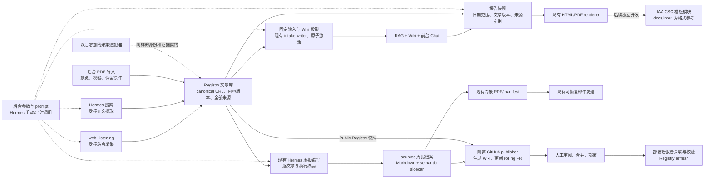

# 文章库驱动的流程与模块边界

整合基线：`origin/main` 的 `21095e8b9f64020d9667a9a0591041eeeb56eba3`（PR #188 / Issue #183）。本次在 `codex/article-first-architecture` 独立工作区修改；原工作区的未提交修改保留。整合前的全部修改有逐文件 SHA-256 备份和独立 Git stash，未直接覆盖到新基线。

核心流程是：**多种采集方式 → 去重并保存文章和来源 → 一致的知识投影 → Chat/Wiki，以及独立的报告、邮件和 GitHub 发布任务**。文章入库不应等周报生成或 GitHub 合并；报告只是文章库的一种输出。

整合顺序（用户确认）：[#181](https://github.com/ferryhe/climate_monitor_wiki/issues/181) / PR #187 → [#183](https://github.com/ferryhe/climate_monitor_wiki/issues/183) / PR #188 → 本次架构整合 → 后续模板 #189。已确认 #183 完成关闭、PR #188 合并到 main，且整合基线包含该结果。复用其共享入库 writer、激活 manifest、统一锁、批次状态、失败历史与重试，取消本线程重叠实现。旧测试结果只代表整合前版本。

## 流程图

`Registry refresh` 是部署后关联报告、核对覆盖并保存备份的任务，**不是首次文章入库任务**。不能把文章去重和入库放在 GitHub 发布之后。

## 五个业务模块与目录归属

| 模块 | 当前目录/入口 | 输入和输出 | 不承担的职责 |
|---|---|---|---|
| 采集 | `climate_monitor/` 的 web/search 适配器与 `pdf_intake`；`scripts/run_agent_acquisition.py` | 站点、查询或 PDF → 有证据和来源的文章观察 | 不直接发邮件、改 Git 或部署；不新增 crawler |
| 文章库 | `climate_registry/` 的 acquisition、PDF intake、schema、read API | 保存 canonical URL 身份、不可变内容版本、追加式来源记录；提供一致快照 | 不决定调度时间，不把未知抓取伪装成成功 |
| 知识服务 | `climate_registry/wiki.py`、现有 intake writer、`agentic_wiki/`、`api_server.py`、`showcase/` | Registry 快照 → Wiki/RAG 投影 → 带引用的检索和 Chat | 不重新采集，不依赖先有本周周报 |
| 报告与交付 | `climate_registry/range_reports.py`、独立日期范围报告入口、`climate_delivery/`、现有 publisher | 固定文章版本 → HTML/PDF；周报 → PDF/manifest/邮件；内容 → GitHub rolling PR | 不在模板里查询、改库或采集；不自动合并 PR |
| 运营后台 | `management_ui/`、`climate_monitor/management.py`、Hermes proxy 和 job wrappers | 参数/prompt 版本、启动/恢复、进度与运行记录 | 不复制 prompt，不建立第二套 scheduler |

`api_server.py` 保持现有 API 和授权入口。`scripts/` 放操作入口，Registry 的 Wiki 渲染归库层所有，移除业务库反向调用 `scripts` 的依赖。不为了目录整齐批量改包名或复制已有实现。

### 各类数据的职责

Registry 是业务上的文章库；部署沿用既有 Public 与 Runtime Writer 角色。Public 保存可发布历史，Runtime Writer 保存管理端入库并通过获准 manifest 激活的资料。publisher 只读取 Public；范围报告读取 Public 加已激活的 runtime 快照。两者共用身份、读取和渲染代码，不把运行时数据库或私有入库资料直接同步到 GitHub。

- Registry：文章身份、网页正文版本、语义信息、抓取与搜索观察、PDF 原件及出现记录的事实库。
- `sources/`：已归档周报的事实来源，保持 append-mostly。文章采集不必先制造一份周报。
- `wiki/`：随 GitHub 发布的可再生知识投影；历史 `daily` 文档类型和 Obsidian payload 保持兼容。
- runtime generations：已激活入库 manifest 的即时投影，网页与 PDF 各用 hash 校验的固定数据库快照。每次从空 staging 按清单生成，不继承上一代无关页面。同名 Registry 生成页在 Chat 与 `/wiki` 中合并公共历史和已激活证据；其他同名页保持 runtime 优先，缺失页面回落到公共历史 Wiki。Runtime 完整性只指其清单覆盖范围，不能用来删除公共历史文章。只有 runtime 中存在、已从新清单撤销且基础 Wiki 没有的页面才会消失。
- report artifacts：固定输入和 renderer 版本的报告、PDF、manifest；邮件发送引用实际 PDF，重试不能偷偷换附件。
- run/queue/status：运行事实、来源覆盖、失败和恢复点，放外部持久存储，不进 Git。

网页以 canonical URL 去重，内容变化保存新版本，保留所有站点和搜索来源。同标题的不同 URL 不合并。同一 PDF 按原件 SHA 去重，文章出现记录保留 PDF、页码和原始链接。只有符合现有 exact canonical URL 与 detail-article 条件的 PDF 链接才能确认到核心文章；首页、目录等仍是 PDF source observations，不能强行宣称已找到原文。

## 本次修改范围

1. 把 Registry 的 Wiki 渲染收拢到 `climate_registry/wiki.py`，供现有 intake pipeline 和 publisher 使用。source/date/index 脚本继续负责周报页，库层不反向调用操作脚本。
2. 复用 `scripts/run_pdf_intake_writer.py` 处理网页和 PDF 激活任务。取消整合前新增的 `sync_registry_index.py`，沿用唯一 `intake-writer` 锁、pending → reload → active、批次进度和失败恢复入口。
3. 每个 runtime generation 只渲染 manifest 指定的网页文章/正文版本/发布日期证据与 PDF occurrence。合并时按 article ID 保留获准来源，不读取 live Writer DB 的新记录，不复制旧代遗留页。
4. KB 与 `/wiki/` 对同名 Registry 生成页采用同一合并规则，公共历史在前、已激活 intake 证据在后；普通同名页保持 runtime 优先，缺失页回落基础 Wiki。失败 reload 保留上一 active 代。#183 的批次摘要、阶段计数、失败历史和只重试失败项保持原契约。
5. publisher 的 Registry 选取与渲染使用同一 SQLite backup。公共生成页清理仅限 `article-[A-Za-z0-9_-]+.md` 与既有 `registry-source-observations.md`；该命名范围为生成页保留，保留仍合格的历史文章、周报、原始资料及范围之外的手工页面，保持 rolling PR 与 main/lease 校验。
6. 增加独立日期范围报告入口。API 与 CLI 共享只读的 active manifest/快照解析，配置了 runtime 却没有 active 清单时使用空 overlay，不读取 pending 或 live Writer DB。文章、会议与 PDF 日历从同一份基础数据库 backup 冻结；Runtime 清单只限制对应 Runtime 快照，不能隐藏已发布 Public 的 PDF 文章、引用或日历。选入文章的日期证据与读取主事实分开：任一合法来源日期命中范围后，保留合法 Public 或已激活网页的固定正文、版本与语义信息；PDF-only overlay 追加来源和日期证据。网页自身日期在范围之外，也不能因此丢掉同一文章已获准的主事实。现有 renderer 和历史产物契约继续复用。

实现评估为 **Complex / Sol high**：设计边界明确，但涉及两个 Registry 域、网页/PDF 固定快照合并、active/pending 切换、范围报告和 publisher 的一致性。保留原实现者完成整合，再由新配置的独立 `gpt-6.1-sol / xhigh` 按上述任务要求复核，原实现者保持既有绑定。

## 自动化如何串起来

时间只是触发器，成功凭据才是下游依赖。采集、索引、报告、邮件、publisher、部署后关联各自可重跑，不要恢复“一条定时任务一个数字 Step”的拆法。

| 独立任务 | 触发方式 | 必须消费的成功结果 | 失败/重跑规则 |
|---|---|---|---|
| 采集并入库 | 各 adapter 独立定时；PDF 由界面入队 | 当前参数/prompt 版本、来源范围、真实证据 | 保留成功观察和失败原因；不覆盖为空成功 |
| 入库知识激活 | 入库后由现有 writer 消费；可独立运行 | 获准 manifest + 固定网页/PDF 快照 | 在空 staging 生成清单范围内新代；失败保留上一 active 代 |
| 周报编写 | Hermes 当前 monitor 入口 | 固定 acquisition batch、逐文章证据 | 复用现有 checkpoint/resume，不重新采集已完成项 |
| 日期范围报告 | Chat 或独立定时入口 | 显式日期范围、固定文章/日历快照 | 复用相同 snapshot/renderer，不依赖 GitHub 合并 |
| 周报 PDF 与邮件 | 现有 `climate_delivery` 入口 | 实际周报 SHA、校验后的 PDF/manifest | 每收件人状态恢复；不盲目重发 ambiguous 状态 |
| GitHub 同步 | 现有 isolated publisher | 已校验周报与一致 Registry 快照 | rolling PR 与人工合并边界不变 |
| 报告关联/校验 | merge/deploy 成功后 | 精确部署报告 SHA、delivery identity、已有 write gates | 未部署或 coverage unresolved 不能宣称完成 |

现有 `CLIMATE_SCHEDULE` 支持 `weekly-utc` 与显式 `biweekly-et`。ET 使用 `America/New_York`，包含夏令时；四个现有 slot 保持 monitor 08:00、email 09:00、publisher 10:00、registry 10:30。本次复用已有 writer 并增加独立报告入口，不安装或改写线上 Hermes jobs，也不改变两小时 monitor/publisher 间隔。生产实际时区、job inventory、部署 SHA 和完整运行仍须读取实时状态。

PDF 的 UI 导入并不是独立 RAG 系统；它和网页/搜索最终使用同一 Runtime Writer 数据库与知识投影。PDF writer 复用既有 `climate_runtime` volume，不能 writable 挂载 Public 数据库；Public 完整读取不承担过滤未激活 Writer 记录的职责。仓库部署配置与 [PDF 导入说明](deployment.md#explicit-management-pdf-imports) 同步。现有 PDF env/API 字段名称保留兼容，不要求先做 compose 和客户端迁移。

## 还缺什么，以及什么可以减掉

必须补的不是更多服务，而是这些清晰边界：

- **来源可追溯和数据版本**：摘要必须知道基于正文、片段还是 PDF 观察；未知发布日期和抓取失败不能变成“没有更新”。现有契约继续保留。
- **跨任务凭据**：下游记录 batch/snapshot/report SHA 和 prompt/template 版本；不能仅因“到了 09:00”就发上次报告。
- **失败恢复与运行观察**：区分 imported、indexed、chat-ready、sent、published、deployed；保留原有状态和真实 scheduler snapshot。
- **备份、恢复与保留期限**：沿用 Registry 备份与 exact restore；投影可以重建，原始证据和发送状态不能随意清掉。上线时明确外部 PDF 原件、快照和 generation 的保留期限及恢复演练，不让运行产物无限累积。
- **模板边界**：将内容选取、报告数据、排版、发送拆开；模板后续单独实现，见下一节。

本次删除/收拢的是重复渲染所有权、“生成全库页后删掉非 PDF 页”的逻辑，以及本线程与 #181 重复的索引入口和私有锁。暂时不删除 legacy Step 脚本、其 wrapper 或测试：最后已记录的调度仍有调用，必须先核对线上 jobs、切换调用者、覆盖替代路径再退役。也不增加 event bus、工作流框架、第二个 crawler、另一套数据库或向量库。

## 后续：IAA CSC 报告模板模块

已建立 [#189：独立 IAA PDF 模板模块，统一 Chat 导出与定时报告排版](https://github.com/ferryhe/climate_monitor_wiki/issues/189)。该 Issue 在 #183 与本次架构整合之后实施，包含共用模板、冻结输入、模板/renderer 版本、历史产物和邮件重试兼容、视觉验收的明确边界。本次授权仅分析并建档，未启动模板实现。

用户指定 `C:/Project/climate_monitor_wiki/docs/input` 为格式参考，**不要求本次改排版**。本次只增加复用现有 renderer 的报告入口，不声称现有 PDF 已与参考版式相同。

参考样本：`IAA_CSC_Climate_Report_20260928.pdf`（53 页）、`IAA_CSC_Climate_Report_2026_09.pdf`（39 页）、`IAA_CSC_Climate_Report_2026_08_2.pdf`（38 页）。最新样本含深蓝/金色封面、IAA 标识、报告期/运行日期与统计、免责声明/Purpose、目录、Executive Summary、Key Dates、按机构 A–Z 的编号更新、Cross-Cutting Watch，以及 coverage log、访问/路线修正、glossary 附录；页脚含报告名、版次和 Page N of M。

后续模板实现应集中到 `climate_delivery/templates/`，替换现有输出排版时升级模板/renderer 版本，不复制采集、筛选、查询或邮件逻辑。输入应是一份已冻结的报告模型，包括：

- 标题/版次、报告窗口和 date of run；
- 机构目录、按机构/主题分组的编号文章及来源引用；
- 摘要与 key dates；
- 真实 monitored/updated/quiet/unverified 计数和对应来源覆盖证据；
- cross-cutting 内容、附录和 glossary；
- 版本化品牌资产、免责声明与页眉页脚。

没有的字段应显示缺失或省略，不能用文章数量推算“已监测机构数”，不能把抓取失败算成 quiet，也不能为凑参考版式虚构内容。验收应检查参考样本代表页面、分页、目录页码、引用可点击、无裁切重叠，以及定时报告和 Chat 导出共用同一模板版本。

目前自动邮件沿用现有周报 delivery 契约；任意日期范围 PDF 的邮件发送尚无该 manifest/发送状态契约，不能把范围快照伪装成周报。本次不新建 mailer。后续如需要此输出，也在现有交付模块复用发送与幂等状态。

## 验证边界

验收覆盖：网页/PDF manifest 外记录不泄漏；网页与 PDF 顺序互换保留已激活身份和正文版本；统一 writer/锁/状态/重试；reload 失败恢复；公共历史回落与 runtime 独有页面撤销；publisher 单快照及精确清理；API/CLI 使用相同已激活固定输入；范围报告文章、会议、PDF 日历一致；#183 批次状态和失败历史。保留 weekly/daily 与 Obsidian API 契约。

本次测试基线为 `21095e8b9f64020d9667a9a0591041eeeb56eba3`，验证时为未提交的本地候选。18 个改动 Python 文件的验证指纹为 `d592d0efc0264889a1dd3898f294057f436ce640bc514625c7784d78ffb21e20`（按路径排序后依次计算路径 UTF-8 字节与文件原始字节）。代码在独立复核和最终完整测试之间保持不变；测试完成后补充本文验证记录；发布 PR #194 时将两个新增文件统一为 LF，并移除 Wiki 渲染模块末尾的多余空行。Python 正文（规范化换行和末尾空行后）与语法树相同，严格 BASE→candidate 空白检查通过；这些格式调整不改变上述功能验证的输入。

| 验证 | 实际结果与限制 |
|---|---|
| 新鲜独立复核 | **PASS**；全部 24 改动路径覆盖，Windows/WSL 文件 SHA 与 Python 指纹一致。独立实例实跑 API/CLI 报告身份一致、固定 Web/PDF 引用、Public 回退、未激活 Writer 内容排除与 WAL 备份 |
| 相关测试 | **343 passed，8 deselected，0 skipped/failed**，79.893 秒；9 个文件覆盖入库激活、范围报告、Chat、Wiki、publisher 和 Compose 约束。8 项 deselected 均为已记录的 WSL Docker CLI 案例，完整套件未排除这些案例 |
| 最终完整套件 | **3352 passed，7 skipped，20 failed**，3379 项，701.385 秒，无 deselection。20 项均涉及不可用的 WSL Docker/Compose，逐项在干净 main 也失败；本轮没有其他失败。不能将此结果称为“全绿” |
| 原生 Compose | Windows 原生 CLI 的 7 项 safe-compose 测试通过；最终叠加配置解析通过，writer 使用 `/pipeline` 的既有 `climate_runtime` volume、无 Public 写挂载。相关配置/测试之后无变化；未启动容器 |
| 本地真实语料 | “Summarize the past 4 weeks” 返回 2026-09-14、09-03、08-31、08-24 四个日期、17 条引用；全部引用文件存在。离线 extractive 模式 |
| 独立报告/周报入口 | 两个 CLI 以 `python -I` 从其他目录运行 `--help` 成功；weekly 渲染 29 个真实报告页、0 个无报告占位页；API/CLI 固定 snapshot ID 与 SHA 一致，实际 PDF 文件生成成功 |
| 静态检查与保存 | `node --check showcase/app.js`、`node --check management_ui/pdf_import.js`、`git diff --check` 通过；整合前 18 份文件备份的 SHA 与保存修改用的 stash 均核对完整 |

7 个跳过用例分别需要未安装的 Hermes `agent`/`model_tools`（4 项）、未提供的真实 Pillar B 重现文件（2 项）和生产 `article_state.json`（1 项）。没有修改测试以绕过这些条件，也没有以本地实例验证代替线上完整周期。

原始 XML、完整日志、逐失败基线对照、独立复核报告和临时实跑证据保存在工作区外：`C:/Users/ferry/.codex/visualizations/2026/10/02/01a0fdde-2350-77c2-99e4-4bd1373c280e/architecture-validation`。当前结果为 `integration-v9-full-results.json`、`integration-v9-full.xml`、`integration-v9-full-comparison.json` 与 `integration-review-v9.md`；更早候选结果保留作过程证据，不能替代本次结果。

本次先完成本地整合、独立复核与测试，再按用户授权提交架构分支并创建 PR。合并、部署和线上 jobs 变更仍未执行。Windows 主机的 Docker engine 当前不可用，使用隔离的 WSL Ubuntu 24.04 / Python 3.12 环境进行基线与候选对照。线上部署 SHA、实时 job inventory 和生产完整周期不在本次本地验证范围内。
