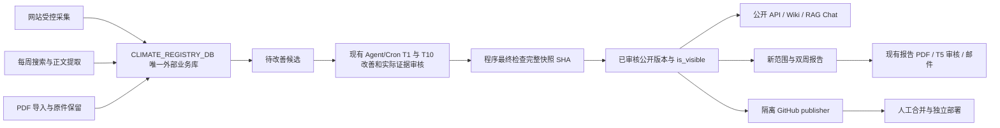

# 单一 Registry 的流程与模块边界

当前写入：schema 22，兼容读取历史 schema 3–21。schema 20 保留人工补充类型，schema 21 增加不可变候选、审核记录和公开版本指针；schema 22 为现有 T1 增加真实 core/native 来源外键。历史 PR/Issue 的整合说明只代表当时实现；本次不启动已关闭的 #189，也不改变报告排版或线上任务数量。

## 流程图

## 数据与状态

网站、搜索、PDF 和 T1/T10 都使用 `CLIMATE_REGISTRY_DB`。业务数据库放在仓库外；已有 wiki 采集服务和 PDF intake writer 挂载同一个外部目录，允许短事务写入。API 的连接保持只读。runtime volume 保存队列、任务状态和可重建投影，不提供第二个业务写库。

任务定义不再提供独立 `runtime.registry_database`。新启动使用当前环境变量，旧任务的路径和 SHA 继续作为固定审计。恢复必须核对当前环境和冻结路径，不一致时拒绝执行；不会改写历史 binding。操作 CLI 可显式指定仓库外的演练副本。

每个 canonical 身份只有一个对用户的展示标记 `is_visible`。它覆盖共享身份的网页/PDF 来源。`true` 仍须有已审核指针；`false` 会从 API 列表、详情、搜索、Wiki、RAG Chat、新范围/双周报告和 publisher 中排除。一个新候选失败或缺少证据，不影响其他已批准项目。更新待审核时继续提供旧的已批准版本。

候选快照包含原始正文、内容/摘要版本、来源身份、日期依据、分类、关键词和 fallback 元数据。最终审核绑定完整 SHA；即使渲染文字相同，正文或来源绑定变化也要求重新审核。公开读者统一恢复该不可变快照，不从增长中的原始库或后来更改的 JSON 补回待审核字段。

## 各模块归属

| 模块 | 入口 | 职责 |
|---|---|---|
| 采集 | `climate_monitor/`、`run_agent_acquisition.py`、`pdf_intake` | 受控观察、正文与 PDF 来源；保留失败和真实证据 |
| 文章库 | `climate_registry/` | canonical 身份、不可变内容/候选/审核、公开版本与共享数据库锁 |
| 知识服务 | `wiki.py`、已有 intake writer、`agentic_wiki/`、`api_server.py` | 同一已审核版本的 API、Wiki 和 RAG 投影 |
| 报告交付 | `range_reports.py`、`climate_delivery/`、已有 publisher | 固定公开输入、现有 HTML/PDF、邮件与隔离 Git 同步 |
| 运营后台 | `management.py`、管理界面、Hermes wrappers | 参数、启动、恢复、任务进度与真实调度记录 |

T1 改善文章及会议事实，T10 使用实际 native Agent 上下文审阅来源和候选，程序执行最终检查。T5 审核生成的报告 PDF。不会用确定性检查冒充 native Agent PASS，也不新增必需服务、Cron 或 crawler。

所有短数据库写事务使用同一个 `<db>.lock`，并在锁内连接数据库。模型和网络请求在锁外。网站冻结、会议处理/冻结、周更和 PDF 替换遵守同一规则，避免替换文件丢失并发写入。

## 历史人工补充与迁移

迁移入口复用 Registry CLI，支持 dry-run、精确备份、共享锁和重复执行。旧公开内容以明确的 `accepted_legacy` 依据建立基线，不冒充新 Agent 审核。已获用户批准的历史 CSV 补充使用独立的 owner-approved 依据。

人工生成记录使用 `generator_kind=manual`，保留字段来源、复用摘要、CSV 行 SHA 和正文/版本 SHA。只有明确标记的 7 条核心记录物化为人工 enrichment。217 条核心补充与 136 条 PDF 分类在候选快照中保持来源。没有正文的 41 条观察摘要仍归属原报告/观察，不制造正文；无法分类的记录可保持未分类。PDF 分类不覆盖 TypeSafe 原字段，保留 PDF hash、页码和 summary basis。迁移时间不会替代首次摄入或实质更新历史。

## 公开快照与档案

`sources/` 与已归档报告/PDF 保持不可变。新报告只消费公开投影，冻结后不随当前可见性变化。历史兼容 schema 仍按原 manifest 契约读取，schema 21 当前读取不靠旧 runtime 清单重新放出待审核数据。

publisher 导出最小 `wiki/public-registry.json` 与公开 Wiki：显示字段、获准正文、来源依据和公开身份，带稳定内容 SHA。SQLite、原始候选、审核私有记录和抓取调试信息不进 Git。Render 使用该 Git 公开快照；没有生产数据库时仍能提供已提交 Wiki 的完整正文。已有 `daily` 文档类型与 Obsidian payload 保持兼容。

详细配置与迁移命令见 [部署说明](deployment.md)、[配置参考](../PIPELINE_CONFIG.md) 和 [流程参考](../PIPELINE_REFERENCE.md)。本地测试、演练和部署分别记录；本次代码完成不代表线上 T1–T10 已完成完整生产周期。
